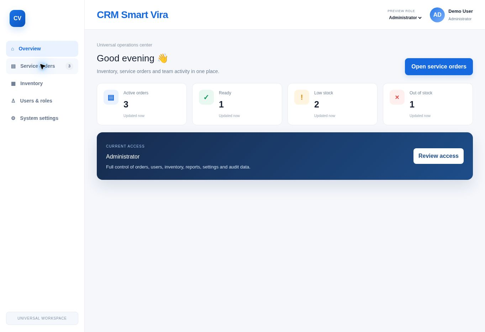
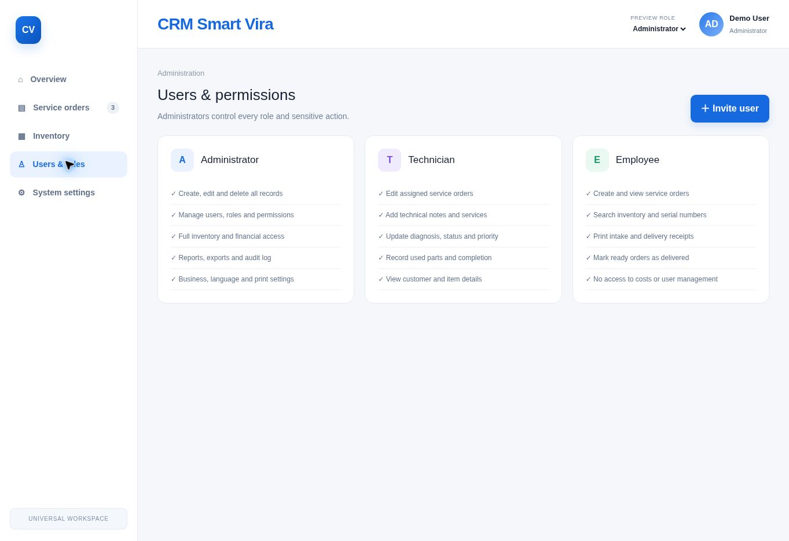

# CRM Smart Vira

CRM Smart Vira is a universal service-order and inventory management workspace designed for repair centers, workshops, and technical service teams.

> This repository is documentation-only. The application source code is proprietary and is not included.

## Overview

CRM Smart Vira brings daily operations into one clear workspace:

- Service-order tracking from intake to delivery
- Inventory monitoring and low-stock alerts
- Role-based access for administrators, technicians, and employees
- Technical notes, service lines, pricing, and work history
- Configurable business identity, language, and currency
- Print-ready service-order views

## Core Workflows

### Service Orders

Create and track jobs, assign technicians, set priorities, update repair status, add services, and maintain a clear technical history.

### Technician Workspace

Technicians can edit assigned jobs, update the diagnosis and priority, add billable services, complete work items, record technical notes, and mark an order as ready.

### Roles and Permissions

Access is separated into three roles so that financial, administrative, and operational data remain appropriately protected.

## Documentation

- [Product Overview](Documentation/PRODUCT_OVERVIEW.md)
- [User Guide](Documentation/USER_GUIDE.md)
- [Roles and Permissions](Documentation/ROLES_AND_PERMISSIONS.md)
- [Operational Workflows](Documentation/WORKFLOWS.md)

## Availability

CRM Smart Vira is a private software product. This repository presents its features and user documentation only. No source code, build files, credentials, API details, or deployment configuration are published.

## Copyright

Copyright © 2026 Mohamad Samer Al Birkdar. All rights reserved.
